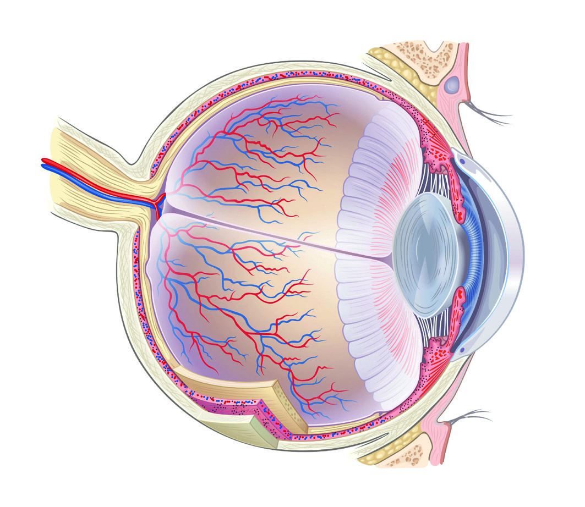

## العين Eye

يمرُّ الضوءُ الصادرُ عن الأجسام أو المنعكس عنها عبر أجزاء في مقدمة العين ليصل إلى الشبكية التي تحوي خلايا متخصصة، تُسمّى المستقبلات الضوئية التي تستقبل الضوء، وتحوّله إلى سيالات عصبية تُرسَل إلى الدماغ عبر العصب البصري؛ لإدراك الصورة وتفسيرها، وتحديد حجوم الأجسام وألوانها. أتأمل الشكل (6) الذي يبيّن تركيب العين.

**✓ أتحقق:** ما الفرق بين القرنية والقزحية؟

الشكل (6) تركيب العين.

*   **القزحية:** قرصٌ عضليٌّ ملونٌ.
*   **القرنية:** الجزء الأمامي الشفاف من العين.
*   **البؤبؤ:** فتحةٌ في وسط القزحية تتحكم في كمية الضوء التي تدخل العين.
*   **العدسة**
*   **الجسم الهدبي:** يغيّر شكل العدسة.
*   **العصب البصري**
*   **الشبكية:** الطبقة الداخلية التي تحوي المستقبلات الضوئية.

## الجلد Skin

يغطي جلدُ الإنسان جسمَه كلَّه، ويحتوي على أنواع متعددة من المستقبلات الحسّيّة التي تختلف باختلاف المنبه، ومن المنبهات التي تستجيب لها؛ الحرارة، والضغط، والألم. أتأمل الشكل (7).

**أفكر**
أيُّ المستقبلات الحسّيّة الموجودة في الجلد يستخدمها الكفيف في القراءة بلغة برايل؟

الشكل (7) يحوي الجلد مستقبلات حسية تستجيب للضغط البسيط، وأخرى للضغط العالي، فيحس الإنسان بحركة حشرة على يده مثلاً.

15